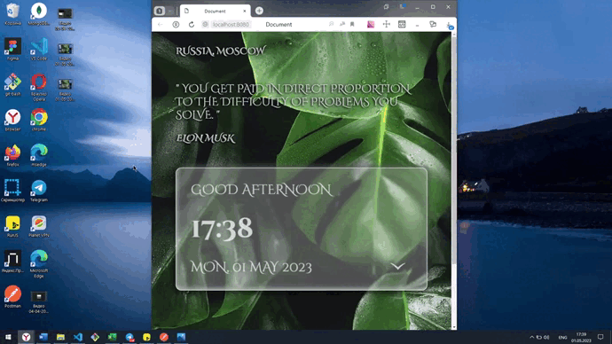

## ***Watch - Получение данных на основе местоположения пользователя***

Приложение "Watch" получает текущую информацию о геолакации, дате и времени через публичное API. Полученная информация о времени обновляется каждую секунду методами JavaScript. Дополнительно, при клике на "стеклянную" панель можно посмотреть какой по счёту этот день в году, в неделе, какая неделя по счёту в году, время восхода и захода солнца, длину дня. Рандомно выводится цитата. Выполнена адаптивная вёрстка (320px - 1440px). Собственный дизайн приложения.

~~~~~~~~~~

~~~~~~~~~~

### ***Стэк:***
* CSS, Flexbox, Grid Layout, БЭМ
* HTML
* JavaScript, ООП
* Webpack

### Ссылки:
* :clock2: [Ссылка на проект](https://gutmalina.github.io/watch/)
* :mailbox_with_no_mail: [API](https://ipgeolocation.io/)